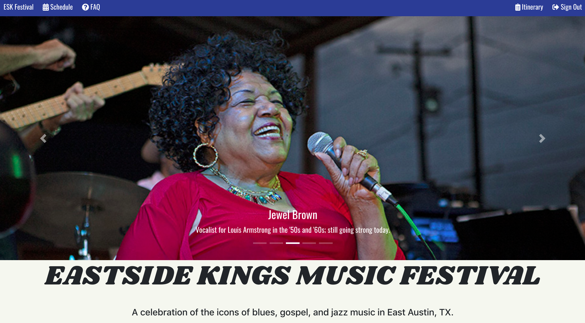
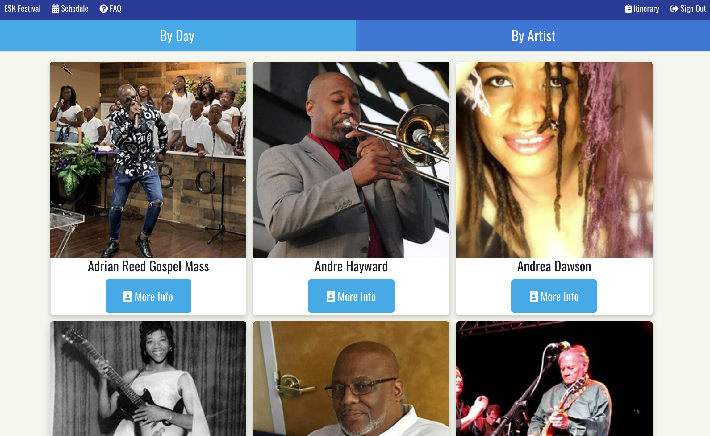
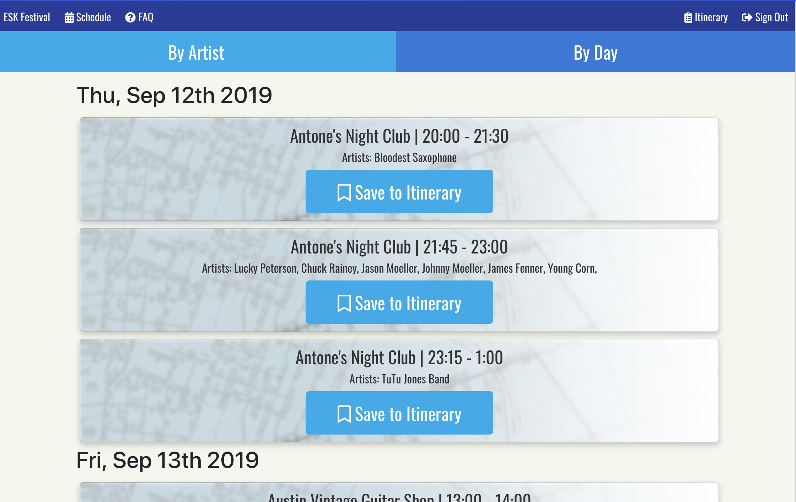

# Eastside Kings Festival
  https://esk-fest.herokuapp.com

## Executive Summary
  Our goal was to create an app which allows the user to view information about Austin’s Eastside Kings Festival.
  The app is mobile responsive to allow festival attendees to access the schedule on the fly and create a personalized itinerary.

## Overview
### Audience:
Festival attendees (approx 2000/day) - range in age from teen to adult, varying socioeconomic status, local Austinites as well as travelers from other cities/states/countries.

### Problem:
Having an easily accessible app to view festival information such as schedule, location, and artist info.  On the landing page the user will be able to view the festival schedule (filtering by artist or date), view details about each artist including video or sound clips, and create an account to save their favorite artists/performances to a personal itinerary that can be accessed on the go.

Prior to the creation of our app, festival attendees could only view information about the festival on a facebook page. This required the attendee to scroll through all posts to the content they need, and click to view the information they require.  Alternatively, printed schedules are available at the festival site.  These solutions are not as user-friendly and often lead to numerous calls to the festival director as festival days approach.  The Eastside Kings Festival app allows for a streamlined customer experience with information easily accessible at any time and location with minimal navigation required by our users.  Users of the app will learn more about the artists performing at the festival, and therefore can make informed decisions when planning their itinerary. This app will also free up time for the festival director by limiting calls from the general public.

## About
 This app was developed for the Eastside Kings Foundation/Eastside Kings Festival in Austin, TX by the Endemic Design team.

## Technologies Utilized
  * React, Redux, Redux-Form
  * Node, Express
  * MongoDB, Mongoose
  * Authentication using Passport, Bcrypt, JSON Web Tokens

## Endemic Design Team
  * Gabe Alvarez:- https://github.com/spookypants
  * Juan Baquera:- https://github.com/jebaquera
  * Sylvia Jonon:- https://github.com/sjonon
  * Avinash Singh:- https://github.com/avinashsinghdhillon
  * Brittany Taylor:- https://github.com/britt421

## Screenshots

### Main Page

### Schedule By Artist

### Schedule By Day

### Itinerary

